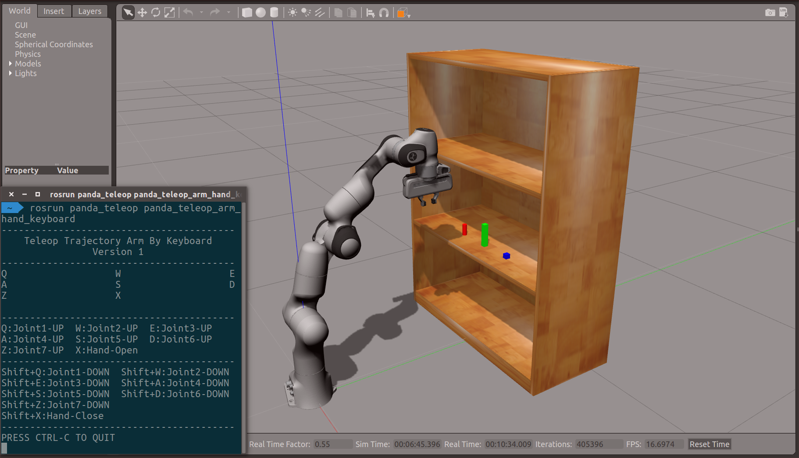
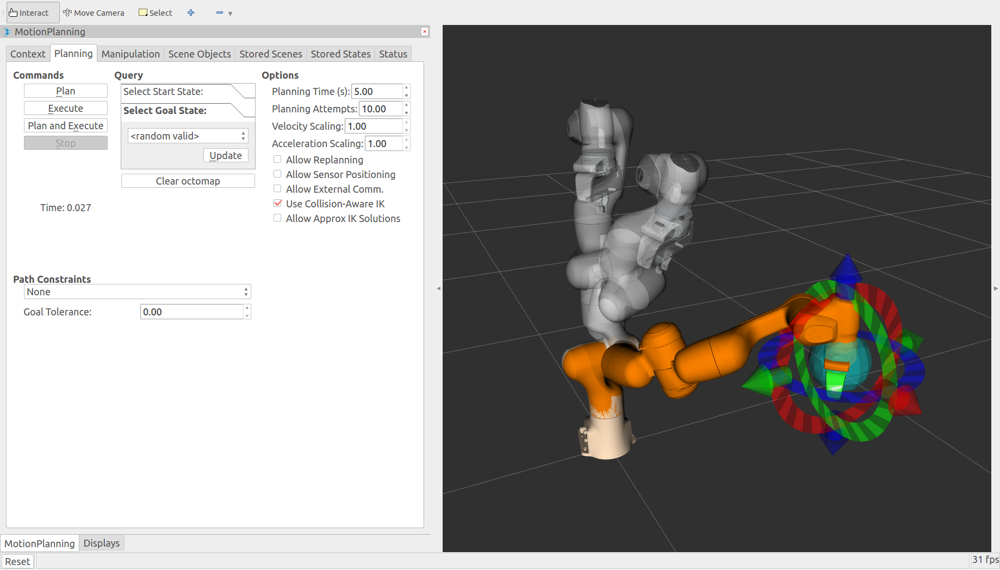
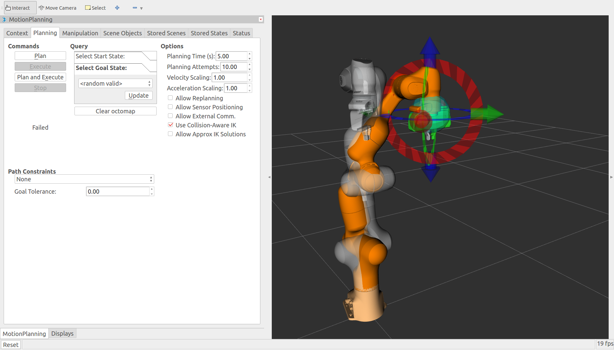

# learning_moveit

## 1. Introduction

This ros metapackage contains some packages that I wrote it myself according to the tutorials provided by the MoveIt! official website. The MoveIt! Tutorials website is: http://docs.ros.org/kinetic/api/moveit_tutorials/html/index.html.


### 1.1 Basic Components

- **panda_bringup**: The panda_bringup package provides roslaunch for starting panda_arm_hand motion planning and simulation test.
- **panda_description**: The panda_description package provides a complete 3D model of the panda_arm_hand for simulation and visualization.

### 1.2 Motion Simulation

- **panda_gazebo**: The panda_gazebo package can launch panda_arm_hand in gazebo simulator.
- **panda_gazebo_controller_config**: The panda_gazebo_controller_config package provides controller configuration files for simulating panda_arm_hand in gazebo.

### 1.3 Motion Control

- **panda_teleop**: The panda_teleop package can control panda_arm_hand by using keyboard.

### 1.4 Motion Planning

- **panda_moveit_config**: The panda_moveit_config package provides configuration and launch files for using the panda_arm_hand with the MoveIt! Motion Planning Framework.
- **panda_moveit_control**: The panda_moveit_control package provides motion planning and control for panda_arm_hand by using kinematics.

## 2. Installation

- Installing ROS packages.
```sh
$> roscd
$> cd ../src
$> git clone https://github.com/myyerrol/learning_moveit.git
$> cd ..
$> rosdep install -y --from-paths src --ignore-src --rosdistro kinetic
$> cd src/learning_moveit
$> ./setup.sh
```

- Building ROS packages.
```sh
$> roscd
$> cd ..
$> catkin_make
```

## 3. Usage

### 3.1 Motion control

```sh
$> roslaunch panda_bringup panda_bringup_gazebo.launch
$> rosrun panda_teleop panda_teleop_arm_hand_keyboard
```




### 3.2 Motion Planning

```sh
$> roslaunch panda_moveit_config demo.launch
```


---

```sh
$> roslaunch panda_bringup panda_bringup_gazebo_and_moveit.launch
```




## 4. Note

### 4.1 Controller Warning

When you run `panda_bringup_gazebo.launch` or `panda_bringup_gazebo_and_moveit.launch`, you will notice that the terminal will output following some warning messages:

```txt
[ WARN] [1534040926.378110292, 0.132000000]: The default_robot_hw_sim plugin is using the Joint::SetPosition method without preserving the link velocity.
[ WARN] [1534040926.378135775, 0.132000000]: As a result, gravity will not be simulated correctly for your model.
[ WARN] [1534040926.378288871, 0.132000000]: Please set gazebo_pid parameters, switch to the VelocityJointInterface or EffortJointInterface, or upgrade to Gazebo 9.
[ WARN] [1534040926.378348094, 0.132000000]: For details, see https://github.com/ros-simulation/gazebo_ros_pkgs/issues/612
```

As mentioned above, the `PositionJointInterface` can't simulate gravity in Gazebo. It must use the `VelocityJointInterface` or `EffortJointInterface`. But because setting the PID parameters of the panda manipulator is very complicated and time-consuming, I chose the `PositionJointInterface` to reduce the workload. **The result is that when the velocity and amplitude of the panda manipulator exceeds a certain value, the entire panda manipulator will fly in Gazebo!** I hope that someone will be able to solve this problem thoroughly.

### 4.2

### 4.3
